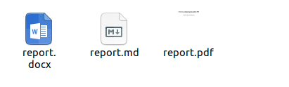
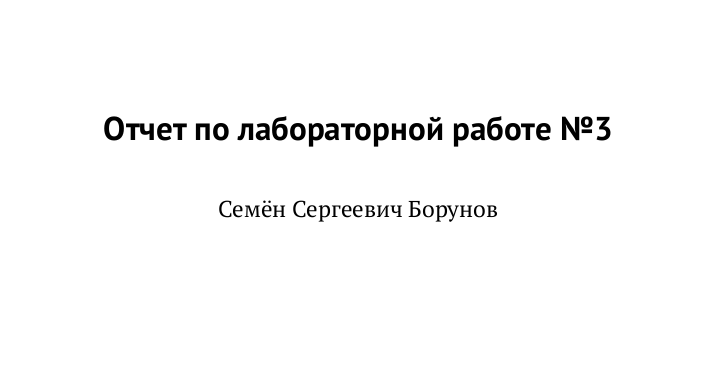

---
## Front matter
lang: ru-RU
title: Презентация отчета 3 лабораторной

author:
  - Борунов С.С.
institute:
  - Российский университет дружбы народов, Москва, Россия

## i18n babel
babel-lang: russian
babel-otherlangs: english

## Formatting pdf
toc: false
toc-title: Содержание
slide_level: 2
aspectratio: 169
section-titles: true
theme: metropolis
header-includes:
 - \metroset{progressbar=frametitle,sectionpage=progressbar,numbering=fraction}
 - '\makeatletter'
 - '\beamer@ignorenonframefalse'
 - '\makeatother'
---

## Цели и задачи

Познакомиться с основными возможностями разметки Markdown.

## Результаты

{#fig:001 width=70%}
Был сделан отчет по лабораторной работе в markdown, после компиляции вышло целых 3 файла, содержащих отчет (рис. @fig:001).

получился красивый отчет без каких-либо сложностей (рис. @fig:002)

{#fig:002 width=70%}

## Итоговый слайд

Были получены основные навыки по работе с разметкой Markdown и по делению отчета на смысловые блоки.

