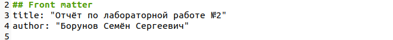
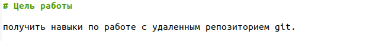
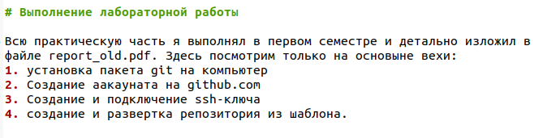
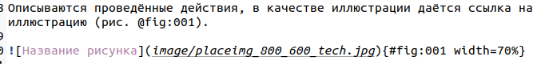
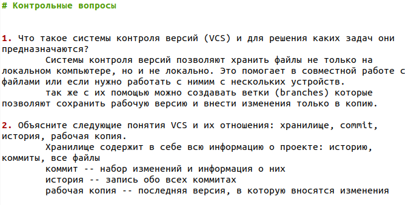
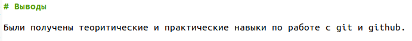

---
## Front matter
title: "Отчет по лабораторной работе №3"
author: "Семён Сергеевич Борунов"

## Generic otions
lang: ru-RU
toc-title: "Содержание"

## Bibliography
bibliography: bib/cite.bib
csl: pandoc/csl/gost-r-7-0-5-2008-numeric.csl

## Pdf output format
toc: true # Table of contents
toc-depth: 2
lof: true # List of figures
lot: true # List of tables
fontsize: 12pt
linestretch: 1.5
papersize: a4
documentclass: scrreprt
## I18n polyglossia
polyglossia-lang:
  name: russian
  options:
	- spelling=modern
	- babelshorthands=true
polyglossia-otherlangs:
  name: english
## I18n babel
babel-lang: russian
babel-otherlangs: english
## Fonts
mainfont: PT Serif
romanfont: PT Serif
sansfont: PT Sans
monofont: PT Mono
mainfontoptions: Ligatures=TeX
romanfontoptions: Ligatures=TeX
sansfontoptions: Ligatures=TeX,Scale=MatchLowercase
monofontoptions: Scale=MatchLowercase,Scale=0.9
## Biblatex
biblatex: true
biblio-style: "gost-numeric"
biblatexoptions:
  - parentracker=true
  - backend=biber
  - hyperref=auto
  - language=auto
  - autolang=other*
  - citestyle=gost-numeric
## Pandoc-crossref LaTeX customization
figureTitle: "Рис."
tableTitle: "Таблица"
listingTitle: "Листинг"
lofTitle: "Список иллюстраций"
lotTitle: "Список таблиц"
lolTitle: "Листинги"
## Misc options
indent: true
header-includes:
  - \usepackage{indentfirst}
  - \usepackage{float} # keep figures where there are in the text
  - \floatplacement{figure}{H} # keep figures where there are in the text
---

# Цель работы

Познакомиться с основными возможностями разметки Markdown.

# Выполнение лабораторной работы

Предыдущий отчет и так был выполнен в формате Markdown, поэтому просто рассмотрим основные блоки и объекты.

В начале создаем титульный лист, на нем название работы и автора(рис. @fig:001).

{#fig:001 width=70%}

Далее создадим блок "цель работы" 
блоки будем выделять заголовками 1 уровня, они создаются с помощью одиночного знака "#"(рис. @fig:002).

{#fig:002 width=70%}

В следующем инофрмативном блоке под названием "Выполнение лабораторной работы" опришем сам ход работы. Здесь используется список. он создается проcто расстановкой чисел с точкой. (рис. @fig:003)

{#fig:003 width=70%}

и так же следует использовать картинки со ссылками и подписями(рис. @fig:004). ссылки указываются так
```
(рис. @fig:001)
```
где всесто 001 может быть любой номер, главное, чтобы он повторялся у картинки, на которою ведет эта ссылка.
картинки создаются так
```
{#fig:004 width=70%}
```
где в квадратных скобках указывается подпись к картинке, в круглых ссылка в памяти, а в фигурных прочие атрибуты, как например номер, чтобы можно было сделать ссылку.

{#fig:004 width=70%}

Далее будет блок ответов на вопросы из лабораторной(рис. @fig:005).

{#fig:005 width=70%}

И наконец блок выводов(рис. @fig:006).

{#fig:006 width=70%}

# Выводы

Были получены основные навыки по работе с разметкой Markdown и по делению отчета на смысловые блоки.

# Список литературы{.unnumbered}

::: {#refs}
:::
