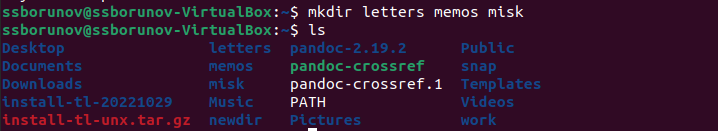
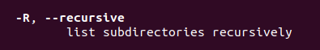
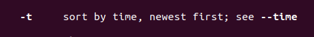

---
## Front matter
title: "Отчёт по лабораторной работе №4"
author: "Борунов Семён Сергеевич"

## Generic otions
lang: ru-RU
toc-title: "Содержание"

## Bibliography
bibliography: bib/cite.bib
csl: pandoc/csl/gost-r-7-0-5-2008-numeric.csl

## Pdf output format
toc: true # Table of contents
toc-depth: 2
lof: true # List of figures
lot: true # List of tables
fontsize: 12pt
linestretch: 1.5
papersize: a4
documentclass: scrreprt
## I18n polyglossia
polyglossia-lang:
  name: russian
  options:
	- spelling=modern
	- babelshorthands=true
polyglossia-otherlangs:
  name: english
## I18n babel
babel-lang: russian
babel-otherlangs: english
## Fonts
mainfont: PT Serif
romanfont: PT Serif
sansfont: PT Sans
monofont: PT Mono
mainfontoptions: Ligatures=TeX
romanfontoptions: Ligatures=TeX
sansfontoptions: Ligatures=TeX,Scale=MatchLowercase
monofontoptions: Scale=MatchLowercase,Scale=0.9
## Biblatex
biblatex: true
biblio-style: "gost-numeric"
biblatexoptions:
  - parentracker=true
  - backend=biber
  - hyperref=auto
  - language=auto
  - autolang=other*
  - citestyle=gost-numeric
## Pandoc-crossref LaTeX customization
figureTitle: "Рис."
tableTitle: "Таблица"
listingTitle: "Листинг"
lofTitle: "Список иллюстраций"
lotTitle: "Список таблиц"
lolTitle: "Листинги"
## Misc options
indent: true
header-includes:
  - \usepackage{indentfirst}
  - \usepackage{float} # keep figures where there are in the text
  - \floatplacement{figure}{H} # keep figures where there are in the text
---

# Цель работы

Ознакомиться с основными командами bash и их флагами.

# Выполнение лабораторной работы

С помощью команды pwd определим путь до домашнего каталога.(рис. @fig:001).

{#fig:001 width=70%}

Перейдем в католог tmp с помощью команды cd и выведем его содержиое с помощью ls.(рис. @fig:002).

{#fig:002 width=70%}

Посмотрим на содердимое tmp применив ls с другими флагами. Здесь флаг 
-а(рис. @fig:003). Этот флаг выводит все файлы, в тч скрытые.

{#fig:003 width=70%}

Чтобы узнать есть ли папка по данному адресу можно например попытаться в нее зайти(рис. @fig:004).

{#fig:004 width=70%}

Далее перейдем в домашний каталог(рис. @fig:005).

{#fig:005 width=70%}

Создадим в домашнем катологе новую папку, внутри нее еще одну, проверим, что внутренняя создалась.(рис. @fig:006).

{#fig:006 width=70%}

Создадим несколько папок разом и проверим, что они создались(рис. @fig:007).

{#fig:007 width=70%}

удалим эти папки. тоже одной командой(рис. @fig:008).

{#fig:008 width=70%}

Попробуем удалить папку комнадой rm без использования флагов.(рис. @fig:009). у нас не выйдет.

{#fig:009 width=70%}

Удалим католог из прошлых пунктов вместе с его подкатлогом(рис. @fig:010).

{#fig:010 width=70%}

Далее с помощью команды man (мужик) рассмотрим флаги команды ls.
Например для рекурсивного вывода подкаталогов можно использовать флаг 
-R(рис. @fig:011)

{#fig:011 width=70%}

А чтобы, например, вывести файлы в порядке их создания, можно испольщовать флаг -t(рис. @fig:012)

{#fig:012 width=70%}

Флаг -Z выводит более подробную информацию об файлах(рис. @fig:013)

{#fig:013 width=70%}

Для команды cd мануала нет, поэтому man не работает с ней

для команды pwd флаги на (рис. @fig:014)

{#fig:014 width=70%}

для команды mkdir флаги на (рис. @fig:015)

{#fig:015 width=70%}

для команды rm флаги на (рис. @fig:016)

{#fig:016 width=70%}

команда history(рис. @fig:017)

{#fig:017 width=70%}

# Выводы

Были получены базовые навыки по работе с командной строкой в unix-подобных ос.

