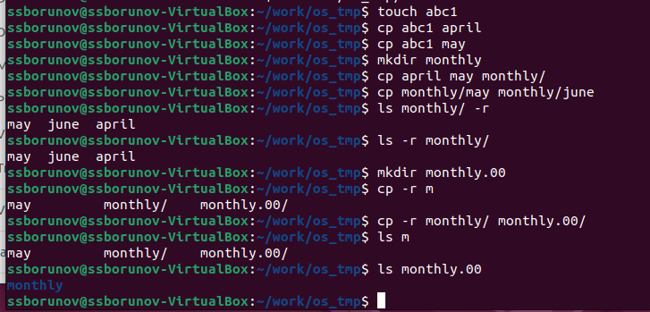
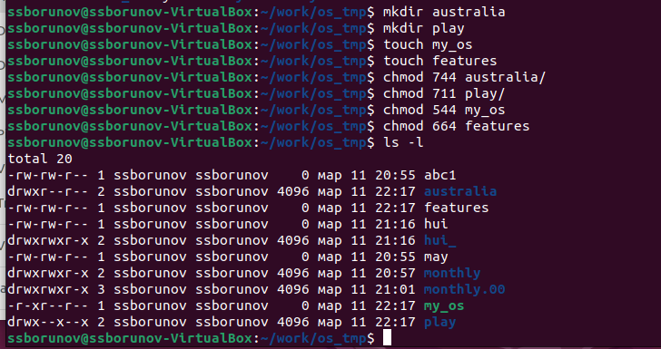
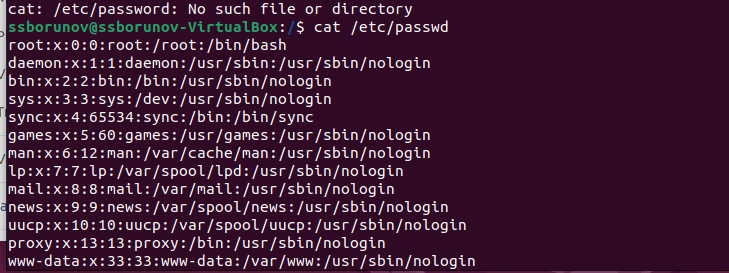
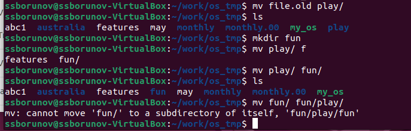

---
## Front matter
lang: ru-RU
title: Отчет по лабораторной 5
author:
  - Борунов С С

## i18n babel
babel-lang: russian
babel-otherlangs: english

## Formatting pdf
toc: false
toc-title: Содержание
slide_level: 2
aspectratio: 169
section-titles: true
theme: metropolis
header-includes:
 - \metroset{progressbar=frametitle,sectionpage=progressbar,numbering=fraction}
 - '\makeatletter'
 - '\beamer@ignorenonframefalse'
 - '\makeatother'
---

## Цели и задачи

Ознакомление с файловой системой Linux, её структурой. Приобретение практических навыков по применению команд для работы
с файлами и каталогами

## Материалы и методы

- Процессор `pandoc` для входного формата Markdown
- Результирующие форматы
	- `pdf`
	- `html`
- Автоматизация процесса создания: `Makefile`

# Выполнение лабораторной работы

1. Выполним примеры из основной части лабораторной(рис. @fig:001). Тут были испольщованы команды cd, ls, cp.

{#fig:001 width=70%}

3. Настроим файлам соответсвующие права доступа(рис. @fig:006).

{#fig:006 width=70%}

4. Файл passwrd(рис. @fig:007).

{#fig:007 width=70%}

перемещение каталогов друг в друга(рис. @fig:009).

{#fig:009 width=70%}

5. Прочтем мануалы по mount, fsck, mkfs, kill

- mount для подключения дисков
- fsck для восстановления файловой системы
- mkfs для создания файловой системы
- kill для отправки сигнала на процесс

## Результаты

Мы ознакомились с файловой системыой LInux и ее структурой, именами и содержание м каталогов
