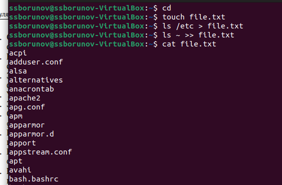
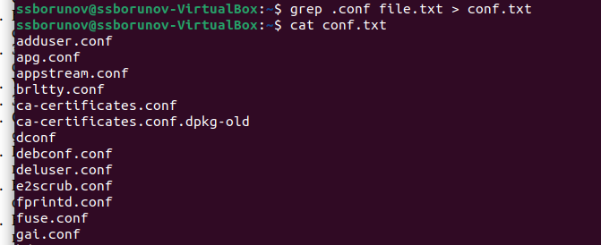
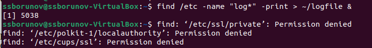
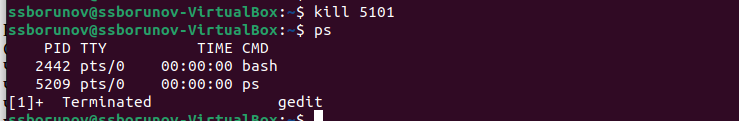

---
## Front matter
lang: ru-RU
title: Презентация лабораторной номер 6
author:
  - Борунов С. С
institute:
  - Российский университет дружбы народов, Москва, Россия

## i18n babel
babel-lang: russian
babel-otherlangs: english

## Formatting pdf
toc: false
toc-title: Содержание
slide_level: 2
aspectratio: 169
section-titles: true
theme: metropolis
header-includes:
 - \metroset{progressbar=frametitle,sectionpage=progressbar,numbering=fraction}
 - '\makeatletter'
 - '\beamer@ignorenonframefalse'
 - '\makeatother'
---

## Цель работы

Познакомится с инструментами поиска и фильтрации информации в командой строке с помощью утилит и инструрментами для управления процессами и памятью.

# Результаты

## Запишем в file.txt названия файлов из /etc затем из ~ 

{#fig:001 width=70%}

## Выведем все файлы с расширением .conf

{#fig:002 width=70%}

## запуск в фоновом режиме записи в файл  ./logfile

{#fig:005 width=70%}

## узнаем номер процесса gedit двумя способами, через ps и ps | grep

{#fig:008 width=70%}

## завершим процесс командой kill и проверим результат через ps

{#fig:010 width=70%}

