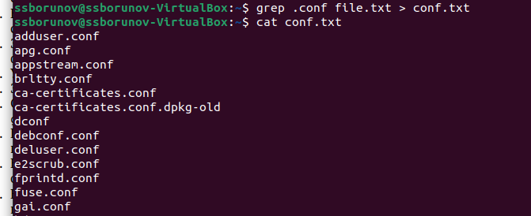
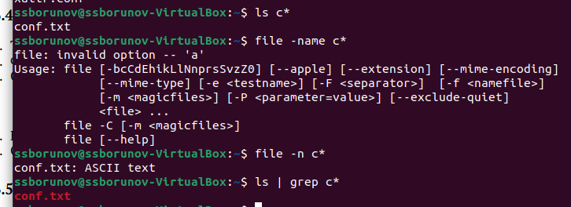
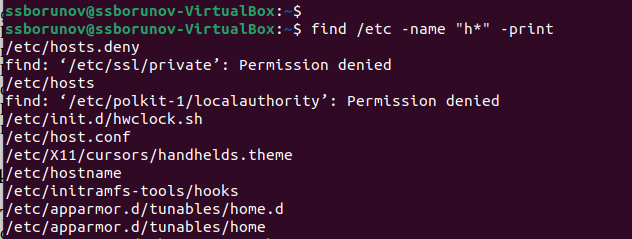
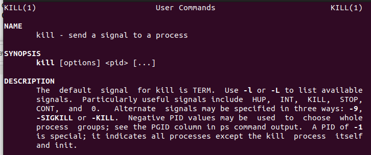
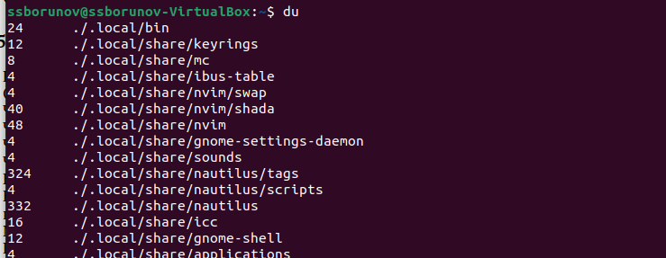
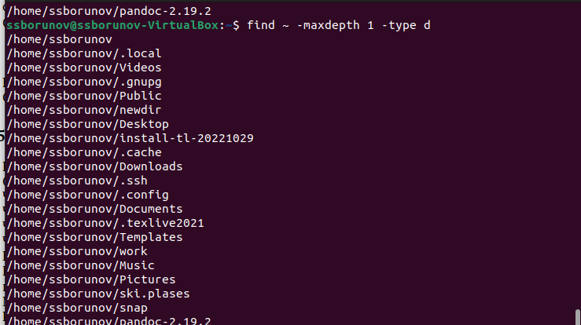

---
## Front matter
title: "отчёт по лабораторной работе №6"
author: "Борунов Семён Сергеевич"

## Generic otions
lang: ru-RU
toc-title: "Содержание"

## Bibliography
bibliography: bib/cite.bib
csl: pandoc/csl/gost-r-7-0-5-2008-numeric.csl

## Pdf output format
toc: true # Table of contents
toc-depth: 2
lof: true # List of figures
lot: true # List of tables
fontsize: 12pt
linestretch: 1.5
papersize: a4
documentclass: scrreprt
## I18n polyglossia
polyglossia-lang:
  name: russian
  options:
	- spelling=modern
	- babelshorthands=true
polyglossia-otherlangs:
  name: english
## I18n babel
babel-lang: russian
babel-otherlangs: english
## Fonts
mainfont: PT Serif
romanfont: PT Serif
sansfont: PT Sans
monofont: PT Mono
mainfontoptions: Ligatures=TeX
romanfontoptions: Ligatures=TeX
sansfontoptions: Ligatures=TeX,Scale=MatchLowercase
monofontoptions: Scale=MatchLowercase,Scale=0.9
## Biblatex
biblatex: true
biblio-style: "gost-numeric"
biblatexoptions:
  - parentracker=true
  - backend=biber
  - hyperref=auto
  - language=auto
  - autolang=other*
  - citestyle=gost-numeric
## Pandoc-crossref LaTeX customization
figureTitle: "Рис."
tableTitle: "Таблица"
listingTitle: "Листинг"
lofTitle: "Список иллюстраций"
lotTitle: "Список таблиц"
lolTitle: "Листинги"
## Misc options
indent: true
header-includes:
  - \usepackage{indentfirst}
  - \usepackage{float} # keep figures where there are in the text
  - \floatplacement{figure}{H} # keep figures where there are in the text
---

# Цель работы

Познакомится с инструментами поиска и фильтрации информации в командой строке с помощью утилит и инструрментами для управления процессами и памятью.

# Выполнение лабораторной работы

1. Запишем в file.txt названия файлов из /etc затем из ~ (рис. @fig:001).

{#fig:001 width=70%}

2. Выведем все файлы с расширением .conf (рис. @fig:002).

{#fig:002 width=70%}

3. Несколько вариантов узнать имена файлов, начинающиеся на с (рис. @fig:003).
2 мпособа чаерез ls и один через file 

{#fig:003 width=70%}

4. имена файлов из /etc, которые начинаются на h(рис. @fig:004).

{#fig:004 width=70%}

5. запуск в фоновом режиме записи в файл  ./logfile (рис. @fig:005).

{#fig:005 width=70%}

6. Удаление ./logfile (рис. @fig:006).

{#fig:006 width=70%}

7. Запуск из консоли в фоновом режиме редактор gedit(рис. @fig:007).

{#fig:007 width=70%}

8. узнаем номер процесса gedit двумя способами, через ps и ps | grep (рис. @fig:008).

{#fig:008 width=70%}

9. посмотрим мануал на команду kill(рис. @fig:009).

{#fig:009 width=70%}

завершим процесс командой kill и проверим результат через ps(рис. @fig:010).

{#fig:010 width=70%}

10. помотрим мануал к команде du(рис. @fig:013).

{#fig:013 width=70%}

выполним команду df (рис. @fig:011).

{#fig:011 width=70%}

выполним команду du(рис. @fig:012).

{#fig:012 width=70%}

11. воспользуемся командой find и выведем подкаталоги каталога ~(рис. @fig:014).

{#fig:014 width=70%}

# Ответы на контрольные вопросы
1. stdin, stdout, stderr.

2. > перенаправляет вывод в новый файл, >> перенаправляет вывод в файл, добавляя содержимое в конце.

4.  процесс — задача, выполняемая процессором; программа — команда для процессора.

# Выводы

Здесь кратко описываются итоги проделанной работы.

