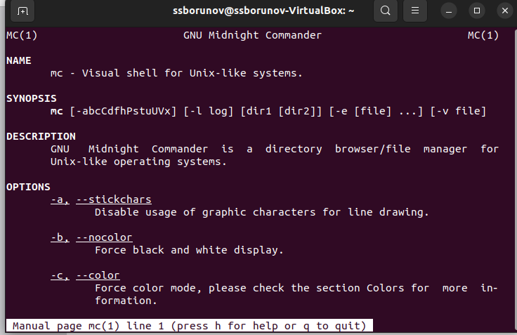
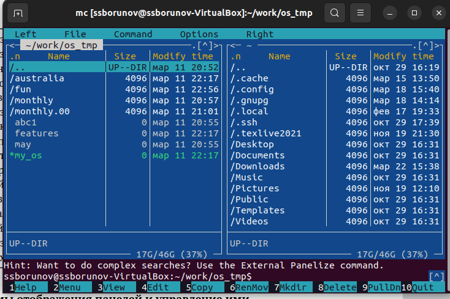
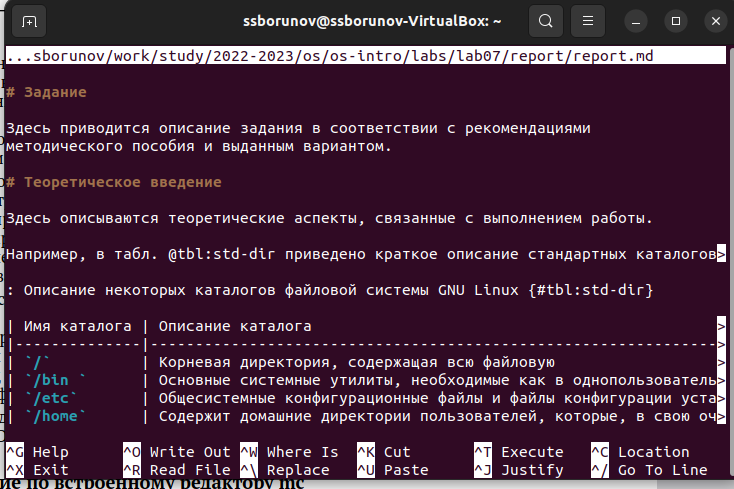
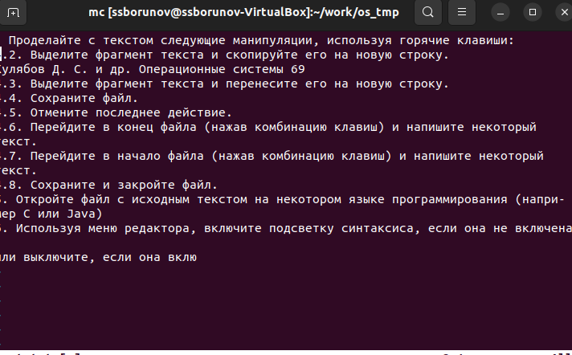

---
## Front matter
lang: ru-RU
title: Презентация лабораторной 
subtitle: номер 7
author:
  - Борунов С. С.
institute:
  - Российский университет дружбы народов, Москва, Россия

## i18n babel
babel-lang: russian
babel-otherlangs: english

## Formatting pdf
toc: false
toc-title: Содержание
slide_level: 2
aspectratio: 169
section-titles: true
theme: metropolis
header-includes:
 - \metroset{progressbar=frametitle,sectionpage=progressbar,numbering=fraction}
 - '\makeatletter'
 - '\beamer@ignorenonframefalse'
 - '\makeatother'
---

## Цели и задачи

Освоение основных возможностей командной оболочки Midnight Commander. Приобретение навыков практической работы по просмотру каталогов и файлов, манипуляций с ними.

## посмотрим мануал для команды mc

{#fig:001 width=70%}

## запустим mc

{#fig:002 width=70%}

## откроем какой-нибудь текстовый файл в редакторе mc.
так вышло, что у меня редактором по умолчанию оказался vim

{#fig:003 width=70%}

## сделаем некотороые манипуляции с текствым файлом в редакторе vim

{#fig:007 width=70%}

