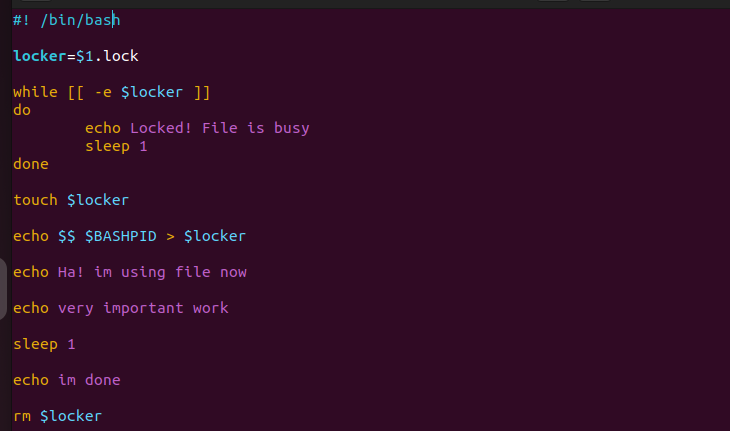
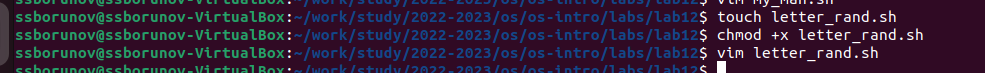
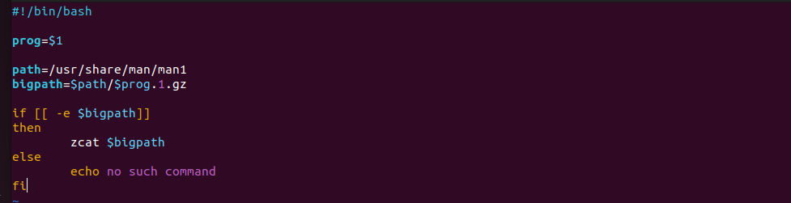

---
## Front matter
lang: ru-RU
title: презентация лабораторной работы
subtitle: номер 12
author:
  - Борунов С. С
institute:
  - Российский университет дружбы народов, Москва, Россия

## i18n babel
babel-lang: russian
babel-otherlangs: english

## Formatting pdf
toc: false
toc-title: Содержание
slide_level: 2
aspectratio: 169
section-titles: true
theme: metropolis
header-includes:
 - \metroset{progressbar=frametitle,sectionpage=progressbar,numbering=fraction}
 - '\makeatletter'
 - '\beamer@ignorenonframefalse'
 - '\makeatother'
---

## Цель работы

Изучить основы программирования в ОС UNIX. Научиться использовать более сложные программы с использованием циклов и условий

## Сощдадим нужный файл и выдадим прово на исполнеие

{#fig:001 width=70%}

## код программы, решающей поставленную задачу

{#fig:002 width=70%}

## Создадим файл для 2 программы, напишем код

{#fig:003 width=70%}

## создаем программу для 3 задачи 

{#fig:004 width=70%}

## Выводы

Мы изучили основы программирования в ОС UNIX. Научились использовать более сложные программы с использованием циклов и условий

:::

