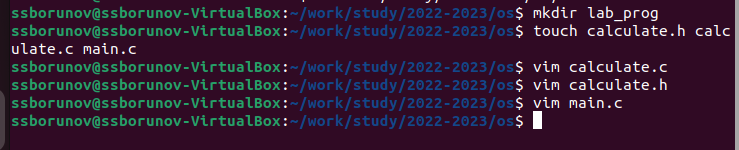
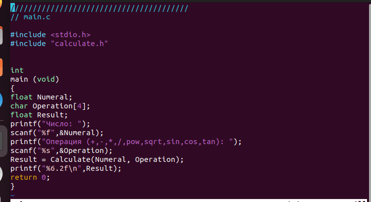
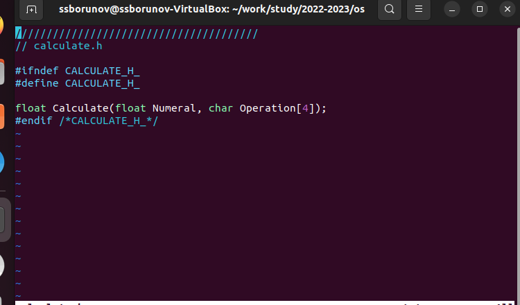
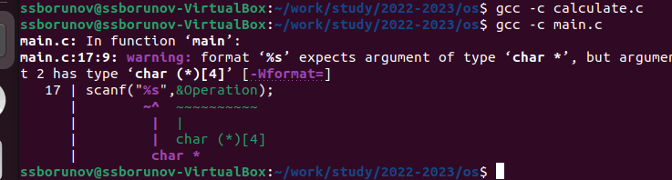
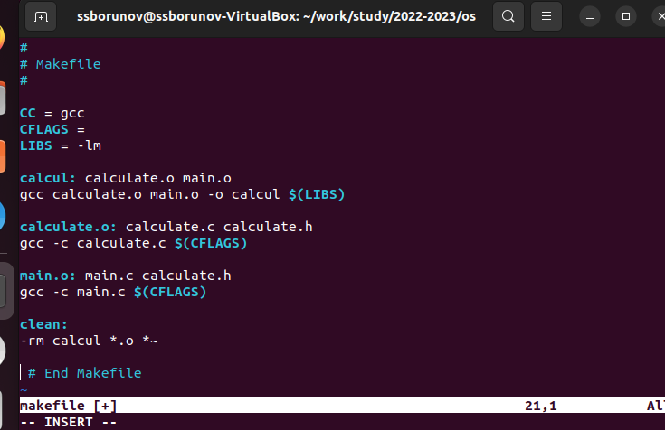

---
## Front matter
lang: ru-RU
title: Структура научной презентации
subtitle: Простейший шаблон
author:
  - Борунов С. С.
institute:
  - Российский университет дружбы народов, Москва, Россия

## i18n babel
babel-lang: russian
babel-otherlangs: english

## Formatting pdf
toc: false
toc-title: Содержание
slide_level: 2
aspectratio: 169
section-titles: true
theme: metropolis
header-includes:
 - \metroset{progressbar=frametitle,sectionpage=progressbar,numbering=fraction}
 - '\makeatletter'
 - '\beamer@ignorenonframefalse'
 - '\makeatother'
---

:::
::::::::::::::

## Цель работы

Цель работы — приобрести простейшие навыки разработки, анализа, тестирования и отладки приложений в ОС типа UNIX/Linux на примере создания на языке программирования С калькулятора с простейшими функциями.

## Выполнение лабораторной работы

## Cоздадим директорию 

{#fig:001 width=70%}

## Создадим файлы

{#fig:002 width=70%}

## Запишем код для файла main.c

{#fig:003 width=70%}

## запишем код в файл calculate.h 

{#fig:004 width=70%}

## Попытаемся скомпилировать все созданные файлы, получим ошибку в файле мейн, но исправить я ее не смогу, я не знаю си

{#fig:005 width=70%}

## создадми makefile и запишем в него исполняемый код

{#fig:007 width=70%}

