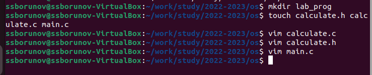
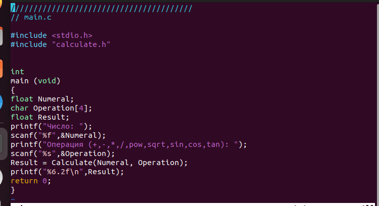
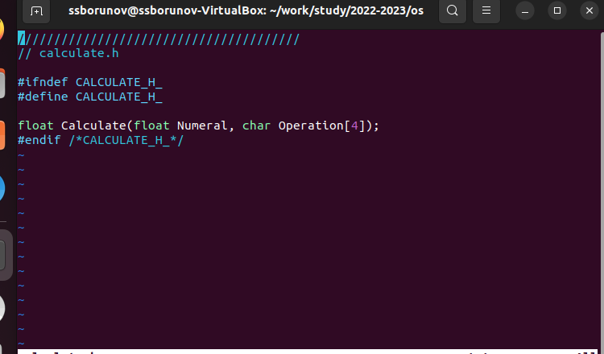
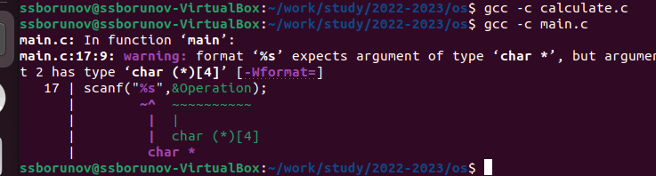
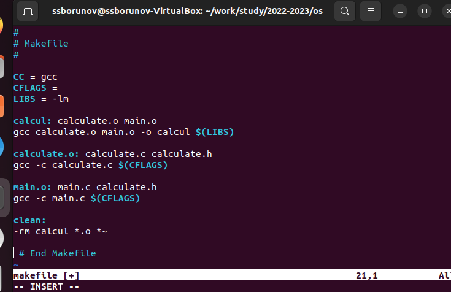

---
## Front matter
title: "отчёт по лабораторной работе"
subtitle: "номер 13"
author: "Борунов Семён Сергеевич"

## Generic otions
lang: ru-RU
toc-title: "Содержание"

## Bibliography
bibliography: bib/cite.bib
csl: pandoc/csl/gost-r-7-0-5-2008-numeric.csl

## Pdf output format
toc: true # Table of contents
toc-depth: 2
lof: true # List of figures
lot: true # List of tables
fontsize: 12pt
linestretch: 1.5
papersize: a4
documentclass: scrreprt
## I18n polyglossia
polyglossia-lang:
  name: russian
  options:
	- spelling=modern
	- babelshorthands=true
polyglossia-otherlangs:
  name: english
## I18n babel
babel-lang: russian
babel-otherlangs: english
## Fonts
mainfont: PT Serif
romanfont: PT Serif
sansfont: PT Sans
monofont: PT Mono
mainfontoptions: Ligatures=TeX
romanfontoptions: Ligatures=TeX
sansfontoptions: Ligatures=TeX,Scale=MatchLowercase
monofontoptions: Scale=MatchLowercase,Scale=0.9
## Biblatex
biblatex: true
biblio-style: "gost-numeric"
biblatexoptions:
  - parentracker=true
  - backend=biber
  - hyperref=auto
  - language=auto
  - autolang=other*
  - citestyle=gost-numeric
## Pandoc-crossref LaTeX customization
figureTitle: "Рис."
tableTitle: "Таблица"
listingTitle: "Листинг"
lofTitle: "Список иллюстраций"
lotTitle: "Список таблиц"
lolTitle: "Листинги"
## Misc options
indent: true
header-includes:
  - \usepackage{indentfirst}
  - \usepackage{float} # keep figures where there are in the text
  - \floatplacement{figure}{H} # keep figures where there are in the text
---

# Цель работы

Цель работы — приобрести простейшие навыки разработки, анализа, тестирования и отладки приложений в ОС типа UNIX/Linux на примере создания на языке программирования С калькулятора с простейшими функциями.

# Выполнение лабораторной работы

Cоздадим директорию (рис. @fig:001).

{#fig:001 width=70%}

Создадим файлы(рис. @fig:002).

{#fig:002 width=70%}

Запишем код для файла main.c(рис. @fig:003).

{#fig:003 width=70%}

запишем код в файл calculate.h (рис. @fig:004).

{#fig:004 width=70%}

Попытаемся скомпилировать все созданные файлы, получим ошибку в файле мейн, но исправить я ее не смогу, я не знаю си(рис. @fig:005).

{#fig:005 width=70%}

создадми makefile и запишем в него исполняемый код(рис. @fig:007).

{#fig:007 width=70%}

# Ответы на контрольные вопросы

Как получить информацию о возможностях программ gcc, make, gdb и др.?
Ответ: при помощи программы man.

Назовите и дайте краткую характеристику основным этапам разработки приложений в UNIX.
Ответ: 1. Выбор названия 2. Выбор языка программирования 3. Попытка выполнить работу всю зараз 4. Отрицание 5. Гнев 6. Торг 7. Депрессия 8. Принятие

Что такое суффикс в контексте языка программирования? Приведите примеры использования.
Ответ: финальная часть названия программы, обычно отделяемая точкой.

Каково основное назначение компилятора языка С в UNIX?
Ответ: компилятор языка C в UNIX в основном компилирует программы языка C в UNIX, написанные на языке C в UNIX.

Для чего предназначена утилита make?
Ответ: для того чтобы делать.

Приведите пример структуры Makefile. Дайте характеристику основным элементам этого файла.
Ответ: всё выполнил, как и просили.

Назовите основное свойство, присущее всем программам отладки. Что необходимо сделать, чтобы его можно было использовать?
Ответ: свойство - анализ кода; для анализа необходимо скомпилировать программу.

Назовите и дайте основную характеристику основным командам отладчика gdb.
Ответ: см. ответ к вопросу 6.

Опишите по шагам схему отладки программы, которую вы использовали при выполнении лабораторной работы.
Ответ: 1. Вначале я запустил gdb 2. Затем я его закрыл

Прокомментируйте реакцию компилятора на синтаксические ошибки в программе при его первом запуске.
Ответ: когда я увидел реакцию компилятора на синтаксические ошибки в программе при его первом запуске,я был возмущён, поражён, обескуражен, ошеломлён, фрустрирован и изумлён. Но использовал совершенно другие выражения.

Назовите основные средства, повышающие понимание исходного кода программы.
Ответ: здравый смысл и нормальный код.

Каковы основные задачи, решаемые программой splint?
Ответ: анализ кода.

# Выводы

В ходе выполнения лабораторной работы были изучены простейшие навыки разработки, анализа, тестирования и отладки приложений в ОС типа UNIX/Linux на примере создания на языке программирования С калькулятора с простейшими функциями. Цель работы была достигнута.

