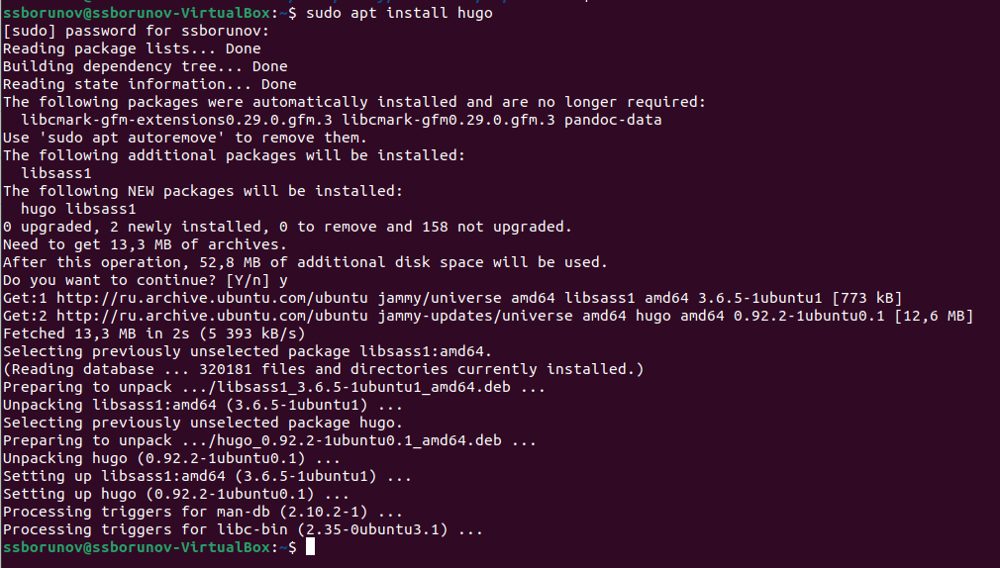
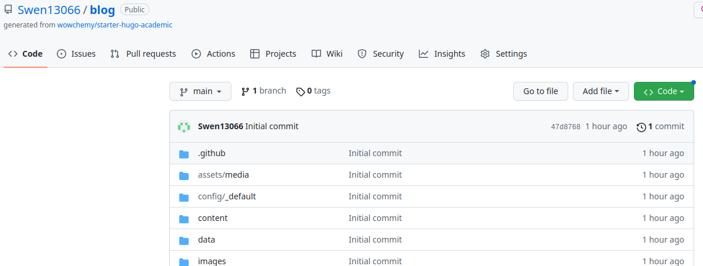

---
## Front matter
title: "Отчет по индивидуальному проекту часть 1"
author: "Борунов Семён"

## Generic otions
lang: ru-RU
toc-title: "Содержание"

## Bibliography
bibliography: bib/cite.bib
csl: pandoc/csl/gost-r-7-0-5-2008-numeric.csl

## Pdf output format
toc: true # Table of contents
toc-depth: 2
lof: true # List of figures
lot: true # List of tables
fontsize: 12pt
linestretch: 1.5
papersize: a4
documentclass: scrreprt
## I18n polyglossia
polyglossia-lang:
  name: russian
  options:
	- spelling=modern
	- babelshorthands=true
polyglossia-otherlangs:
  name: english
## I18n babel
babel-lang: russian
babel-otherlangs: english
## Fonts
mainfont: PT Serif
romanfont: PT Serif
sansfont: PT Sans
monofont: PT Mono
mainfontoptions: Ligatures=TeX
romanfontoptions: Ligatures=TeX
sansfontoptions: Ligatures=TeX,Scale=MatchLowercase
monofontoptions: Scale=MatchLowercase,Scale=0.9
## Biblatex
biblatex: true
biblio-style: "gost-numeric"
biblatexoptions:
  - parentracker=true
  - backend=biber
  - hyperref=auto
  - language=auto
  - autolang=other*
  - citestyle=gost-numeric
## Pandoc-crossref LaTeX customization
figureTitle: "Рис."
tableTitle: "Таблица"
listingTitle: "Листинг"
lofTitle: "Список иллюстраций"
lotTitle: "Список таблиц"
lolTitle: "Листинги"
## Misc options
indent: true
header-includes:
  - \usepackage{indentfirst}
  - \usepackage{float} # keep figures where there are in the text
  - \floatplacement{figure}{H} # keep figures where there are in the text
---

# Цель работы

Пройти первый этап создания индивидуального проекта. Задеплоить созданный на hugo сайт, на гитхаб и выложить его в сеть.

# Выполнение
Установим hugo и go

{#fig:000 width=70%}

Создадим репозиторий из шаблона

{#fig:001 width=70%}

а дальше тока теоритически, ибо оно не работает.

Коммандой `hugo server` запустить сервер

Откроем страницу в браузере

Удалим демоо часть

В файле `contents/_index.md` удалим первую часть yaml файла

Выполним git push

Создание репозитория для сайта

Создадим репозиторий `<username>.github.io`

 
Обновим .gitignore

Перейдем в предыдущий репозиторий и удалим строчку public из gitignore. Отправим изменения на гитхаб

Добавим submodule

Добавим репозиторий horhik.github.io как submodule в папку public 

Как видим, папка public заново создалась

Сгенерируем содержимое сайта 

Отправим изменения в submodule

# Список литературы{.unnumbered}

::: {#refs}
:::

