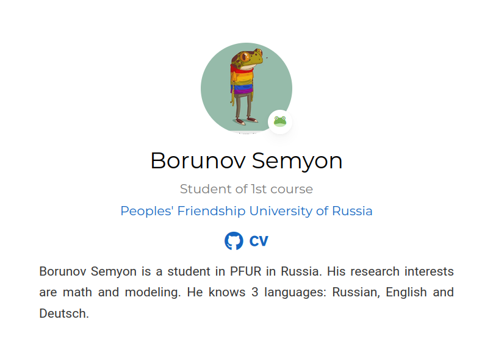
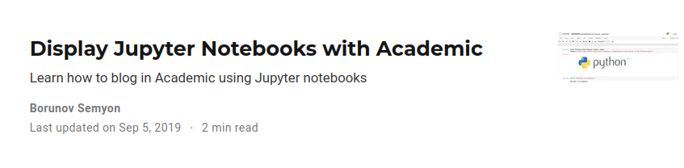

---
## Front matter
lang: ru-RU
title: презентация персонального проекта
subtitle: 2 часть
author:
  - Борунов С. С.
institute:
  - Российский университет дружбы народов, Москва, Россия

## i18n babel
babel-lang: russian
babel-otherlangs: english

## Formatting pdf
toc: false
toc-title: Содержание
slide_level: 2
aspectratio: 169
section-titles: true
theme: metropolis
header-includes:
 - \metroset{progressbar=frametitle,sectionpage=progressbar,numbering=fraction}
 - '\makeatletter'
 - '\beamer@ignorenonframefalse'
 - '\makeatother'
---

# Выполнние 

## Сделаем описание,корректное имя, аватарку, исправим принадлежномть к университету 

{#fig:001 width=70%}

## Dобавим посты, проверим верно ли стоит автор 

{#fig:002 width=70%}
