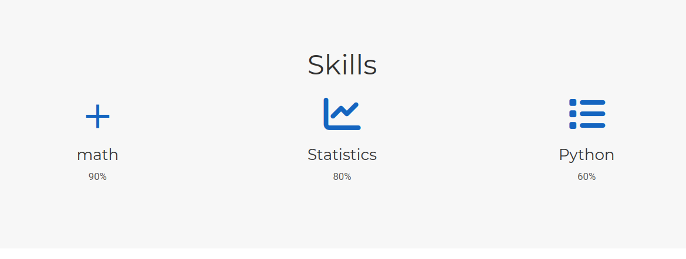
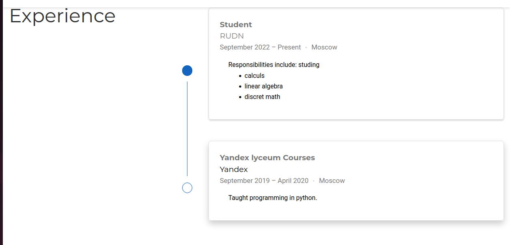
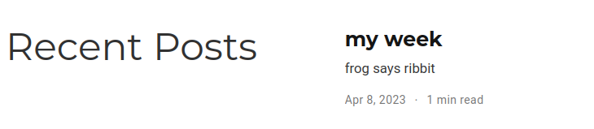

---
## Front matter
lang: ru-RU
title: презентация 
subtitle: по чему-то там
author:
  - Борунов С. С.
institute:
  - Российский университет дружбы народов, Москва, Россия

## i18n babel
babel-lang: russian
babel-otherlangs: english

## Formatting pdf
toc: false
toc-title: Содержание
slide_level: 2
aspectratio: 169
section-titles: true
theme: metropolis
header-includes:
 - \metroset{progressbar=frametitle,sectionpage=progressbar,numbering=fraction}
 - '\makeatletter'
 - '\beamer@ignorenonframefalse'
 - '\makeatother'
---

# Цель работы

добавить информацию про навыки, опыт, обучение, сделать пост

# Выполнение лабораторной работы

сделали skills

{#fig:001 width=70%}

сделали expirience

{#fig:002 width=70%}

сделали пост

{#fig:003 width=70%}

# Выводы

мы что-то написали и добавили

